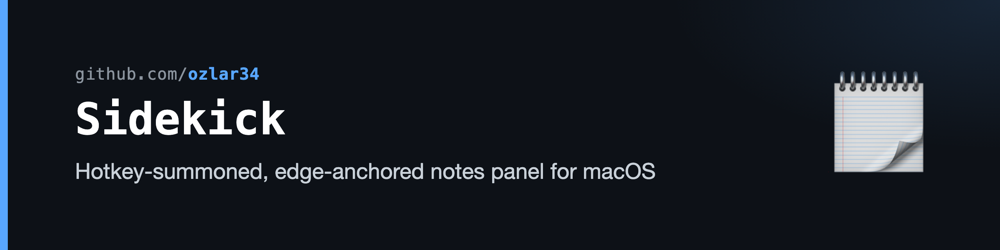
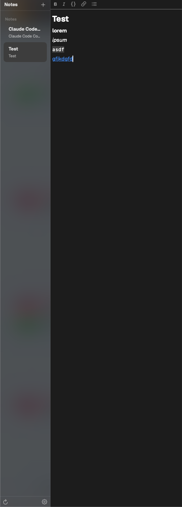

# Sidekick

A hotkey-summoned, edge-anchored notes panel for macOS. Tap a global shortcut, a translucent panel slides in from the side of the screen, you write, you dismiss it. Notes persist as plain `.md` files in a folder you control. Built as a replacement for SideNotes when I wanted the speed of a hotkey-summoned scratch surface without giving up file ownership.



## Features

- Global hotkey to summon and dismiss
- Edge-anchored translucent panel that stays out of the way
- Hybrid markdown editor: live formatting (bold, italic, inline code, links, lists) over plain `.md` text
- Notes saved as individual `.md` files in a folder you choose
- Lightweight sidebar for note switching
- Native macOS, no Electron, no web view

## Built with

- Swift, SwiftUI + AppKit hybrid (`NSTextView`-backed editor for live formatting, SwiftUI for everything else)
- Tested on macOS 14+
- Built with the assistance of [Claude Code](https://claude.ai/code) by Anthropic
- Covered by 35+ test files including regression guards for the editor and markdown parsing

## Build and run

Requires Xcode 15+ / Swift 5.9+.

```
./build-and-run.sh
```

Builds a release `.app` to `/Applications/Sidekick.app` and launches it.

## License

MIT. See [LICENSE](LICENSE).

## Debug harness (for automated UI diagnosis)

Launch the built binary with `--debug-port <n>` to start a localhost control
server that can summon the panel, open notes, synthesize real clicks and
keystrokes, dump caret and glyph geometry, and screenshot the panel window.
Pair it with `--debug-notes-folder <path>` so the run never touches your
real notes:

```
swift build -c release
.build/release/Sidekick --debug-port 4567 --debug-notes-folder /tmp/sidekick-fixtures
curl -X POST localhost:4567/summon
curl localhost:4567/state
curl -X POST localhost:4567/click -d '{"x":120,"y":10}'
curl -X POST localhost:4567/screenshot -d '{"path":"/tmp/panel.png","region":"editor"}'
```

Endpoints are listed at the top of `Sources/Sidekick/Debug/DebugHarness.swift`.
Without the flag the harness is inert.

`Scripts/debug-harness/` holds a bundle launcher (`debug-launch.sh <notes-folder>`),
a Python driver (`sk.py sweep <note title>` runs a geometric caret sweep that
clicks every glyph and reports caret mismatches), and fixture notes covering
links, lists, checklists, and dividers.
